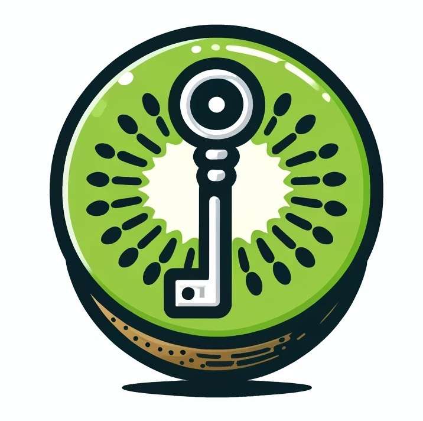

Keyvi is a custom Keycloak login authenticator that integrates Yivi for handling custom credentials. This project allows you to extend Keycloak's authentication capabilities by incorporating Yivi for more secure and customizable login methods.

## Pre-requisites
- A domain for Keycloak and a subdomain (or domain for Yivi)
- Obtaining Let's Encript certificates for these domains.


## Requirements
- JDK 11 or higher
- Docker and Docker Compose
- Maven

## Project Structure
- **src:** contains the source code for the custom authenticator.
- **docker files** docker-related files and configurations.
- **setup-keycloak.sh**: a script to configure Keycloak realms automatically. After server's first start-up.


## Build the Project
Note: Before building the project, make sure to customize docker-compose.yml and Dockerfile to include your domain for Keycloak and 
themes/keyvi/login/login.ftl to include your domain for Yivi.

```
./mvnw clean install
docker compose build
docker compose up
```

### Notes:
DO NOT USE for production! This prototype is in demonstration phase and uses the plain flow between Yivi client in theme folder and Yivi server (which should be set up with docker seperately). 
The local-main branch starts up Keycloak in localhost to test changes,for this Yivi should also be in localhost.

